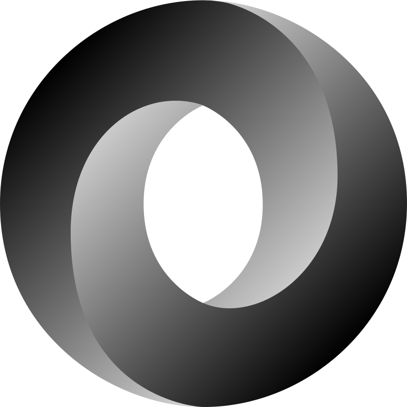

#### 👾 Hi there, i'm Rebecca!

<!--  -->
<!--  -->

<!--  -->

<!--  -->

#### 🚀 I'm a javascript developper who is passionate about coding!

- 🔭 I’m currently working on this [][chatbot]
- 👯 I’m looking to collaborate on project with
- 📫 How to reach me: [][linkedin] and kanurebecca0@gmail.com
- 🥅 2021 goals: work on more algorithms
- ⚡ Fun fact: i love drawing and reading Webtoons

#### 🔬Languages and Tools:

    
    
    
      
    
       
    
    
    
    
    
    
    <!-- 
     -->
 

 

 

<!-- ### ✨ Recent Activity -->

<!--START_SECTION:activity-->

<!-- 1. 💪 Opened PR [#14602](https://github.com/webpack/webpack/pull/14602) in [webpack/webpack](https://github.com/webpack/webpack)
2. 💪 Opened PR [#3019](https://github.com/webpack/webpack-cli/pull/3019) in [webpack/webpack-cli](https://github.com/webpack/webpack-cli)
3. 💪 Opened PR [#1605](https://github.com/nuxt/framework/pull/1605) in [nuxt/framework](https://github.com/nuxt/framework)
4. 💪 Opened PR [#1412](https://github.com/nuxt/framework/pull/1412) in [nuxt/framework](https://github.com/nuxt/framework)
5. 💪 Opened PR [#1409](https://github.com/nuxt/framework/pull/1409) in [nuxt/framework](https://github.com/nuxt/framework) -->
   <!--END_SECTION:activity-->
   <!--
    -->

 
 

[chatbot]: https://rebeccaramalho.github.io/Chat_Bot/
[linkedin]: https://www.linkedin.com/in/rebecca-kanu-1537121a6/

<!-- - 🌱 I’m currently learning -->
