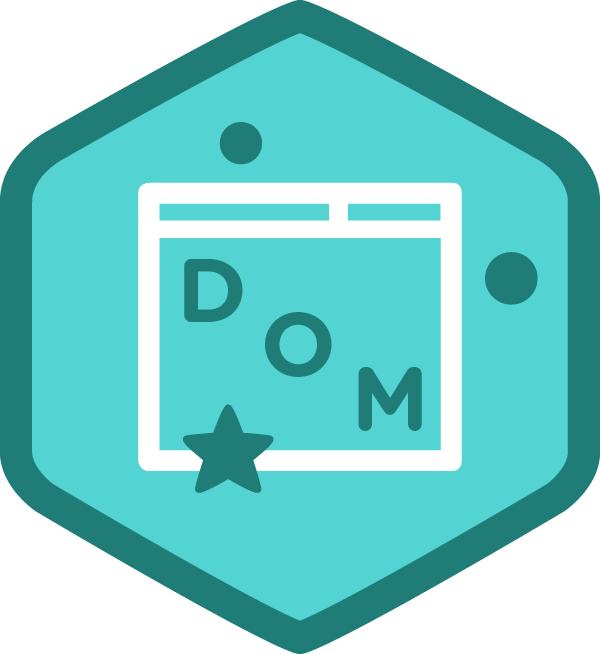

### Hi there 

## I'm a javascript developper who is passionate about coding!

- 🔭 I’m currently working on this [][chatbot]
- 🌱 I’m currently learning 
- 👯 I’m looking to collaborate on project with 
- 📫 How to reach me: kanurebecca0@gmail.com
- 🥅 2021 goals: work on more algorithms
- ⚡ Fun fact: i love reading Bd and Webtoons

## 🌍 Connect with me:

[][linkedin]

 

## Languages and Tools:

    
    
      
    
     
    
    
    
    
     
    
    
    
    
    
    

 
 

[chatbot]: https://github.com/RebeccaRamalho/Cv
[linkedin]: https://www.linkedin.com/in/rebecca-kanu-1537121a6/
