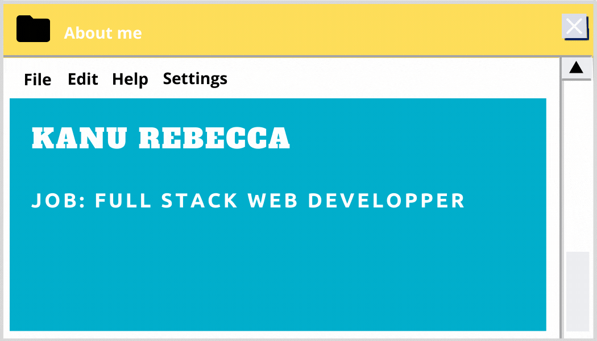

### Hi there, i'm Rebecca!

 

### I'm a javascript developper who is passionate about coding!

- 🔭 I’m currently working on this [][chatbot]

- 👯 I’m looking to collaborate on project with
- 📫 How to reach me: [][linkedin] and kanurebecca0@gmail.com
- 🥅 2021 goals: work on more algorithms
- ⚡ Fun fact: i love drawing and reading Webtoons
   

### Languages and Tools:

    
    
    
      
    
       
    
    
    
    
    
    
    
    
 

>

 
 

[chatbot]: https://github.com/RebeccaRamalho/Cv
[linkedin]: https://www.linkedin.com/in/rebecca-kanu-1537121a6/

<!-- - 🌱 I’m currently learning -->
